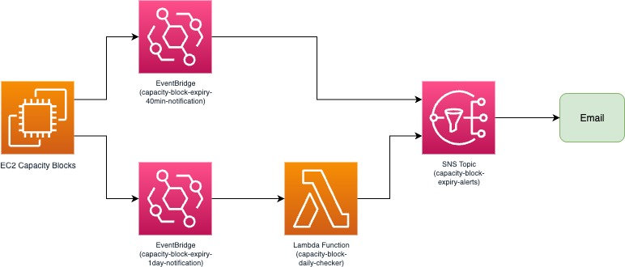

# AWS Capacity Block Expiry Notification System

Automated notification system for AWS EC2 Capacity Block expiry alerts with notification timing.

## Features

- **Notifications**: 24-hour advance warning (custom) + 40-minute warning (AWS native)

## Architecture



## Components

- **Lambda Function**: Daily checker for 24-hour advance notifications
- **EventBridge Rules**: Native AWS events (40min) + scheduled Lambda execution (24hr)
- **SNS Topic**: Email notification delivery
- **IAM Roles**: Least privilege permissions

## Quick Start

1. **Clone Repository**
   ```bash
   git clone https://github.com/marianachow0321/aws-capacity-block-notifications.git
   cd aws-capacity-block-notifications
   ```

2. **Configure Email**
   ```bash
   # Edit variables.tf
   variable "notification_email" {
     default = "your-email@domain.com"
   }
   ```

3. **Deploy Infrastructure**
   ```bash
   terraform init
   terraform plan
   terraform apply
   ```

4. **Confirm Email Subscription**
   - Check your email for SNS confirmation
   - Click the confirmation link

## Configuration

### Timezone Setting
Edit `capacity-block-checker.py`:
```python
LOCAL_TIMEZONE_OFFSET = 8  # Change to your timezone offset
```

### Email Address
Edit `variables.tf`:
```hcl
variable "notification_email" {
  default = "your-email@domain.com"
}
```

## Notification Timeline

- **24 hours before**: Custom Lambda notification with detailed info
- **40 minutes before**: AWS native notification (standard warning)

## Requirements

- AWS CLI configured
- Terraform >= 1.0
- Python 3.13 (Lambda runtime)